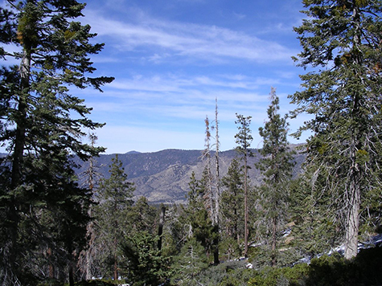

```{r setup, include=FALSE}
knitr::opts_chunk$set(echo = FALSE)
```

## Backgrouund

Nation-wide fire suppression was enacted throughout US Forest Service areas in the early 20th century (Safford & Stevens, 2017). These suppression policies led to altered fire regimes, shifts in forest composition and structure, and an increase in ladder fuels - potentially increasing the probability of more severe fires (Miller & Safford, 2017; Nigro & Molinari, 2019). Climate change is expected to exacerbate these negative effects by increasing the frequency of extreme temperature events and reduce average precipitation (Hayhoe et al., 2004). These potential environmental risks can threaten the many trees that live within the national forests.

### Yellow Pine and Mixed Conifer (YPMC) forests



**Figure 1.** Mixed conifer forest in San Bernardino National Forest. [Source](https://www.fs.fed.us/database/feis/fire_regimes/CA_montane_mixed_conifer/all.html)

Yellow Pine Mixed Conifer forests are susceptible to being lost to those environmental risks because they are located in geographically isolated sky islands (Minnich & Everett, 2001). These forests contain the following species:

- [Jeffrey pine](https://www.fs.fed.us/database/feis/plants/tree/pinjef/all.html) (*Pinus jeffreyi*)
- [Ponderosa pine](https://www.fs.fed.us/database/feis/plants/tree/pinponp/all.html) (*Pinus ponderosa*)
- [Sugar pine](https://www.fs.fed.us/database/feis/plants/tree/pinlam/all.html) (*Pinus lambertiana*)
- [White fir](https://www.fs.fed.us/database/feis/plants/tree/abicon/all.html) (*Abies concolor*)
- [Incense cedar](https://www.fs.fed.us/database/feis/plants/tree/caldec/all.html) (*Calocedrus decurrens*)

These species thrive in high elevations and cool temperatures (Safford & Stevens, 2017). These forests provide critical habitat for wildlife like the California Spotted Owl (*Strix occidentalis occidentalis*), and continue to provide invaluable ecosystem services such as clean air and carbon sequestration (Schimel & Braswell, 2005; Gonzalez et al., 2015; Hilberg et al., 2016). Land managers are currently looking for ways to conserve these forests.

## Data Layers

The following layers were added to the map:

- Yellow pine and mixed conifer forest polygons from [CALVEG](https://www.fs.usda.gov/detail/r5/landmanagement/resourcemanagement/?cid=stelprdb5347192)
- Digital Elevation Model (DEM) raster (30 m resolution) from [US Geological Survey EarthExplorer](https://earthexplorer.usgs.gov/)
- 2014 climate data from the [Basin Characterization Model](http://climate.calcommons.org/dataset/2014-CA-BCM) (BCM) for the following variable: actual evapotranspiration (AET), climatic water deficit (CWD), minimum temperature, and maximum temperature
- [Boundaries](https://data.fs.usda.gov/geodata/edw/datasets.php?dsetCategory=boundaries) for the four National Forests in Southern California: Angeles National Forest, Cleveland National Forest, Los Padres National Forest, and San Bernardino National Forest

## Map


## Works Cited

Hilberg, L. E., Reynier, W. A., & Kershner, J. M. (2016). Southern California Climate Change
Vulnerability Assessment: Conifer Habitats. Version 1.0. **EcoAdapt**, Bainbridge Island, WA.

Gonzalez, P., Battles, J. J., Collins, B. M., Robards, T., & Saah, D. S. (2015). Aboveground live carbon stock changes of California wildland ecosystems, 2001–2010. *Forest Ecology and Management, 348,* 68-77. doi:10.1016/j.foreco.2015.03.040

Hayhoe, K., et al. (2004), Emissions pathways, climate change, and impacts on California, Proc. 
Natl. Acad. Sci. U. S. A., 101(34), 12,422–12,427, doi:10.1073/pnas.0404500101.

Miller, J. D., & Safford, H. D. (2017). Corroborating Evidence of a Pre-Euro-American Low- to Moderate-Severity Fire Regime in Yellow Pine-Mixed Conifer Forests of the Sierra Nevada, California, USA. *Fire Ecology, 13(1),* 58–90. https://doi.org/10.4996/fireecology.1301058

Minnich, R. A., & Everett, R. G. (2001). Conifer Tree Distributions in Southern California. *Madrono (USA), 48(3),* 177–197.

Nigro, K., & Molinari, N. (2019). Status and trends of fire activity in southern California yellow pine and mixed conifer forests. *Forest Ecology and Management, 441,* 20–31. https://doi.org/10.1016/j.foreco.2019.01.020

Safford, H. D., & Stevens, J. T. (2017). *Natural Range of Variation for Yellow Pine and Mixed-Conifer Forests in the Sierra Nevada, Southern Cascades, and Modoc and Inyo National Forests, California, USA.* 

Schimel, D., & Braswell, B. H. (2005). The Role of Mid-latitude Mountains in the Carbon Cycle: Global Perspective and a Western US Case Study. *Advances in Global Change Research Global Change and Mountain Regions,* 449-456. doi:10.1007/1-4020-3508-x_45